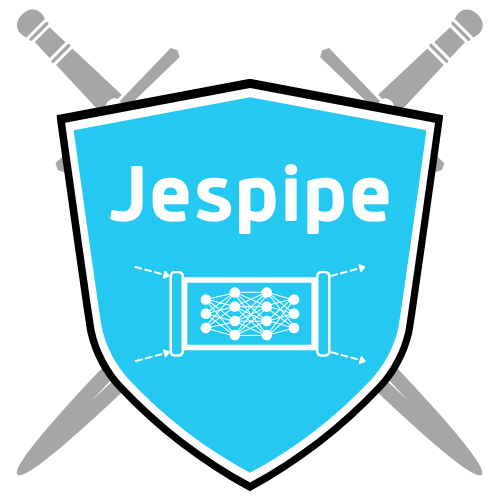

<p align="center">
    
</p>

<h3 align="center">Jespipe</h3>

<p align="center">
    An easy-to-use system for conducting adversarial machine learning analysis using OpenMPI, XML control files, and user-written plugins.
    <br />
    <a href="https://github.com/NucciTheBoss/jespipe/wiki"><strong>Explore Jespipe Docs »</strong></a>
    <br /><br />
    <a href="https://github.com/NucciTheBoss/jespipe/issues/new?assignees=NucciTheBoss&labels=bug&template=bug-report.md&title=BUG%3A+Error+encountered+during+Jespipe+runtime">Report Bug</a>
    ·
    <a href="https://github.com/NucciTheBoss/jespipe/issues/new?assignees=NucciTheBoss&labels=enhancement%2C+question&template=feature-request.md&title=FEATURE+REQUEST%3A+Potential+improvement+to+Jespipe">Request Feature</a>
    ·
    <a href="https://github.com/NucciTheBoss/jespipe/discussions">Discussions</a>
    ·
    <a href="https://github.com/NucciTheBoss/jespipe/releases">Releases</a>
</p>

## Jespipe v0 - Experimental

Welcome to the Jespipe repository! Our default branch is for the development of the Jespipe v0 Experimental release. If you are interested in helping us publish a professional, robust release of Jespipe, please check out our [contributing guidelines](https://github.com/NucciTheBoss/jespipe/blob/main/CONTRIBUTING.md)!

## Table of Contents

* [Quick Start](#quick-start)
* [What's Included](#whats-included)
* [Documentation](#documentation)
* [Bugs and Feature Requests](#bugs-and-feature-requests)
* [Contributing](#contributing)
* [Versioning](#versioning)
* [Creators](#creators)
* [Copyright and License](#copyright-and-license)
* [Citation](#citation)

## Quick Start
* [System Requirements](#system-requirements)
* [Install Dependencies](#install-dependencies)
* [Install OpenMPI](#install-openmpi)
* [Install Jespipe](#install-jespipe)
* [Where to go from here?](#where-to-go-from-here)

### System Requirements

The recommended runtime environment for Jespipe is on High-Performance Computing clusters, but your system only has to meet the following minimum requirements in order to run Jespipe:

| Category | Minimum Requirement |
| :--- | :---: |
| **Operating System:** | CentOS 7 or newer, Debian 10 or newer, OpenSUSE 15.3 or newer, RedHat Enterprise Linux 7 or newer, Ubuntu 18.04 or newer |
| **Number of Processor Cores:** | Bare minimum: 2 cores - 4 threads; Recommended: 8 cores - 16 threads |
| **RAM:** | Bare minimum: 4GB; Recommended: 16GB |
| **GPU:** | *Not required but recommended for larger-scale models and computationally instensive attacks.* |
| **GCC Version:** | GCC version 8.3.1 or greater |
| **Python Version:** | 3.5+, 3.8+, 3.9.5, or 3.9.6 |

**It is strongly recommended** that you use Jespipe on a High-Performance Computing cluster because while Jespipe's system resource consumption is minimal, under-powered machines will be quickly overwhelmed by large-scale adversarial analyses.

### Install Dependencies

Use the following commands to install Jespipe's system-level dependencies according to your operating system.

#### CentOS / RedHat Enterprise Linux:

```bash
sudo yum update
sudo yum groupinstall "Development Tools" "Development Libraries"
wget https://www.python.org/ftp/python/3.9.6/Python-3.9.6.tar.xz -O - | tar -xJv
cd Python-3.9.6
./configure --enable-shared --enable-optimizations
make && sudo make install
```

#### OpenSUSE:

```bash
sudo zypper update
sudo zypper install -t pattern devel_basis
sudo zypper install python39-base python39-devel python39-pip
```

#### Ubuntu / Debian:

```bash
sudo apt-get update
sudo apt-get install build-essential python3.9-full python3.9-dev python3-pip
```

### Install OpenMPI

Use the following commands to install OpenMPI according to your operating system.

#### CentOS / RedHat Enterprise Linux:

```bash
sudo yum install openmpi openmpi-devel
```

#### OpenSUSE:

```bash
sudo zypper install openmpi4 openmpi4-libs openmpi4-devel openmpi4-config openmpi4-docs
```

#### Ubuntu / Debian:

```bash
sudo apt-get install openmpi-bin openmpi-common openmpi-doc
```

### Install Jespipe

With the system-level dependencies and OpenMPI installed on your system, use the following commands to set Jespipe up on your system.

#### Install from release (for production):

To install Jespipe from a release, first download a [release](https://github.com/NucciTheBoss/jespipe/releases) and then use the following commands:

```bash
tar -xzvf jespipe-<release-number>.tar.gz
cd jespipe-<release-number>
pip install -r requirements.txt
python setup.py install
```

#### Install from source (for development):

To install Jespipe from source, use the following commands:

```bash
git clone https://github.com/NucciTheBoss/jespipe.git
cd jespipe
pip install -r requirements.txt
python setup.py install
```

#### Test Installation:

If all went well, you should be able to print out Jespipe's version info without issue:

```
$ python main.py --version

       _                 _                     ___   ___  __ 
      | |               (_)                   / _ \ / _ \/_ |
      | | ___  ___ _ __  _ _ __   ___  __   _| | | | | | || |
  _   | |/ _ \/ __| '_ \| | '_ \ / _ \ \ \ / / | | | | | || |
 | |__| |  __/\__ \ |_) | | |_) |  __/  \ V /| |_| | |_| || |
  \____/ \___||___/ .__/|_| .__/ \___|   \_/  \___(_)___(_)_|
                  | |     | |                                
                  |_|     |_|                                
 

Jespipe-v0.0.1  Copyright (C) 2021  Jason C. Nucciarone, Eric Inae, Sheila Alemany

This program comes with ABSOLUTELY NO WARRANTY; for details please see the LICENSE file. 
This is free software, and you are welcome to redistribute it
under certain conditions; please visit https://github.com/NucciTheBoss/jespipe for more details.
```

### Where to go from here?

* **If this is your first time using Jespipe** for conducting adversarial machine learning analysis, please check out our [Introduction to Jespipe](https://github.com/NucciTheBoss/jespipe/wiki/Introduction-to-Jespipe) tutorial! 

* **If you are familiar with Jespipe, but like to learn all that Jespipe is capable of**, please look through our [documentation](https://github.com/NucciTheBoss/jespipe/wiki).

* **If you are an old pro with Jespipe**, have fun!

## What's Included

```
jespipe
├── CODE_OF_CONDUCT.md
├── CONTRIBUTING.md
├── LICENSE
├── LICENSE_DOCS
├── README.md
├── .config.json
├── main.py
├── requirements.txt
├── setup.py
├── assets
├── contrib
│   ├── build-tools
│   ├── diagrams
│   │   └── drawio
│   └── pseudocode
├── etc
│   ├── skel
│   │   ├── control-templates
│   │   └── plugin-templates
│   │       ├── attack
│   │       ├── manip
│   │       ├── model
│   │       └── plot
│   └── ursula
├── examples
│   ├── control-files
│   ├── datasets
│   │   ├── google-stock
│   │   ├── google-stock-xgb
│   │   └── ozone-level-detection
│   └── plugins
│       ├── attacks
│       ├── manips
│       ├── models
│       │   └── RNN
│       └── plots
├── jespipe
│   └── plugin
│       ├── attack
│       ├── clean
│       ├── manip
│       └── train
└── utils
    ├── appinfo
    ├── filesystem
    ├── managerops
    ├── workeradmin
    └── workerops
```

There are about 80+ files distributed with a release of Jespipe so it would not be practical to go through all of them, but here is a list of the most important files and directories:

#### Files

* `README.md` - A copy of this README.

* `LICENSE` - A copy of the GNU General Public License version 3.

* `.config.json` - Default configuration file for Jespipe.

* `main.py` - **The Jespipe application.**

* `requirements.txt` - File to install all of Jespipe's external dependencies.

* `setup.py` - File to install *jespipe-plugin* module.

#### Directories

* `assets` - Pictures and text files used by Jespipe.

* `contrib` - Files to help with the development of Jespipe.

* `etc` - Extra configuration files and skeleton files for Jespipe.

* `examples` - Examples for Jespipe.

* `jespipe` - The *jespipe-plugin* module needed for plugins.

* `utils` - Helper functions used by Jespipe.

## Documentation

Jespipe's documentation is currently hosted using GitHub's Wiki pages [here](https://github.com/NucciTheBoss/jespipe/wiki). If you interested in adding to the documentation such as add on to the Wikipages or adding more forms of documentation (manpages, readthedocs, Sphinx, etc.), please check out our [contributing guidelines](https://github.com/NucciTheBoss/jespipe/blob/main/CONTRIBUTING.md)!

## Bugs and Feature Requests

Have a bug or feature request that you want to submit? Please read through Jespipe's [issue guidelines](https://github.com/NucciTheBoss/jespipe/blob/main/CONTRIBUTING.md#using-the-issue-tracker) first and search for existing and closed issues. If your issue or idea has not been addressed yet, feel free to [open a new issue](https://github.com/NucciTheBoss/jespipe/issues/new).

The Jespipe developers have provided the following issue templates for submitting a bug report and/or feature request:

* [Submit a Bug Report](https://github.com/NucciTheBoss/jespipe/issues/new?assignees=NucciTheBoss&labels=bug&template=bug-report.md&title=BUG%3A+Error+encountered+during+Jespipe+runtime)
* [Submit a Feature Request](https://github.com/NucciTheBoss/jespipe/issues/new?assignees=NucciTheBoss&labels=enhancement%2C+question&template=feature-request.md&title=FEATURE+REQUEST%3A+Potential+improvement+to+Jespipe)

## Contributing

Please read through our [contributing guidelines](https://github.com/NucciTheBoss/jespipe/blob/main/CONTRIBUTING.md). Included are directions for opening issues, coding standards, and how to submit contributions to Jespipe.

All Python code should follow the standards outlined in [PEP 8](https://pep8.org/), [PEP 257](https://www.python.org/dev/peps/pep-0257/), and [PEP 484](https://www.python.org/dev/peps/pep-0484/). All function and class docstrings should follow the [reStructuredText Markup Specification](https://docutils.sourceforge.io/docs/ref/rst/restructuredtext.html).

## Versioning

For transparency into Jespipe's release cycle and in an attempt to support older High-Performance Computing clusters, Jespipe is maintain under the [the Semantic Versioning guidelines](https://semver.org/). Jespipe's developers may sometimes make mistakes, but we will adhere to these rules as best we can.

See the [releases section of Jespipe's repository](https://github.com/NucciTheBoss/jespipe/releases) for changelogs for each release version of Jespipe. Sometimes they might not be pretty, but the Jespipe developer's will do their darnest to summarize the most noteworthy changes in each release.

## Creators

* Jason C. Nucciarone - Pennsylvania State University - Author
  * [LinkedIn](https://www.linkedin.com/in/jasonnucci/)

* Eric Inae - Andrews University - Contributor
  * [LinkedIn](https://www.linkedin.com/in/eric-inae-6056b1214)

* Sheila Alemany - Florida International University - Contributor
  * [Sheila's Personal Site](https://sheilaalemany.github.io/)
  * [LinkedIn](https://www.linkedin.com/in/sheilaalemany)

## Copyright and License

Code and documentation copyright &copy; 2021 Jason C. Nucciarone, Eric Inae, and Sheila Alemany. Code released under the [GNU General Public License version 3](https://www.gnu.org/licenses/gpl-3.0.en.html). Documentation is released under the [BSD 3-Clause License](https://opensource.org/licenses/BSD-3-Clause).

## Citation

**Our paper for Jespipe is still a work in progress**, but if you use Jespipe in your work before we have finished our paper, please use the following citation in your paper:

```
@article{Jespipe,
  title={Jespipe: An easy-to-use system for conducting adversarial machine learning analysis.},
  author{Sheila Alemany+, Jason C. Nucciarone+, Eric Inae, and Niki Pissinou},
  journal{https://github.com/NucciTheBoss/jespipe},
  year={2021}
}
```
